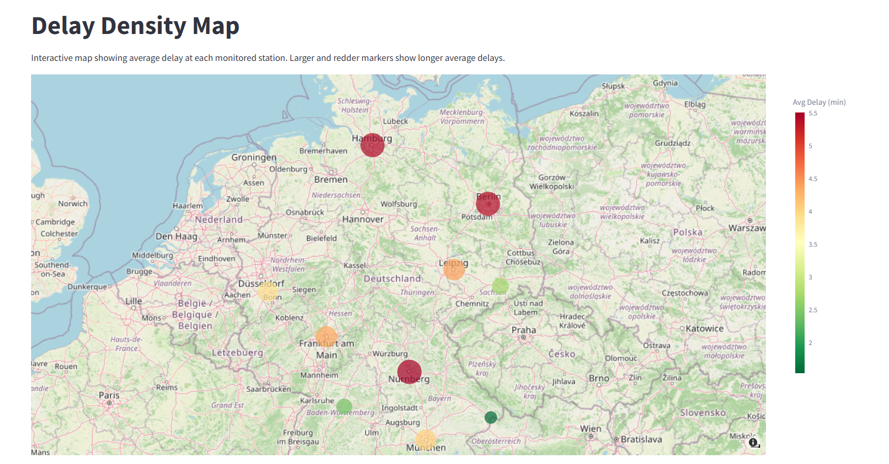
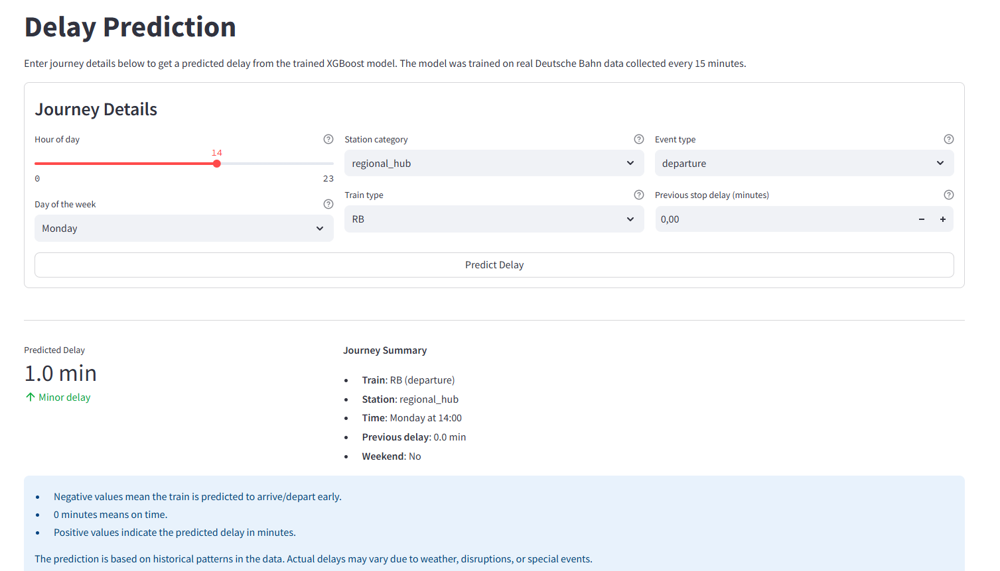
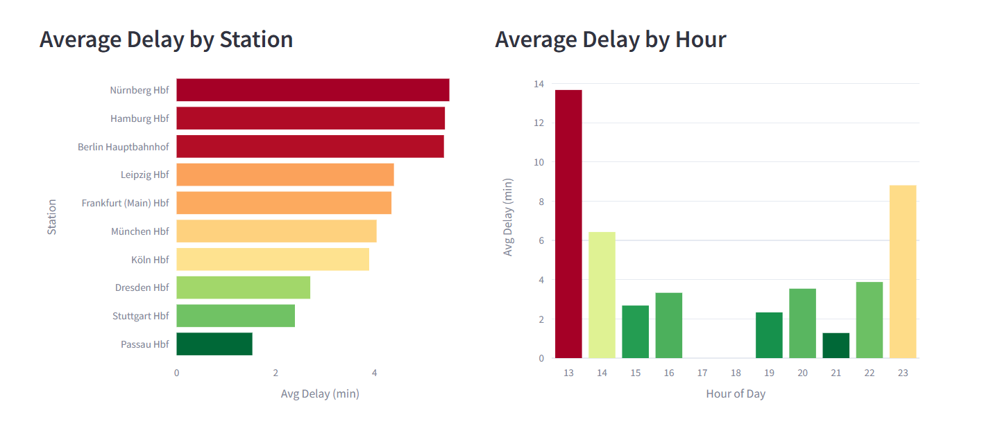

# Deutsche Bahn Delay Analysis

> A data engineering and machine learning pipeline that collects real-time train departure/arrival data from the official Deutsche Bahn Timetables API, transforms it through a dbt schema, trains an XGBoost delay prediction model, and serves predictions with a FastAPI microservice. All of them are visualised in a live Streamlit dashboard.

**Live Demo:** [Streamlit Dashboard](https://db-delay-analysis.streamlit.app/)

---

## Features

- Airflow pipeline: Two tasks fetch train events for 10 German stations and run dbt. GitHub Actions starts a real Airflow scheduler for each cloud run. Local Docker also provides the Airflow web UI.
- dbt transformation layer: Staging views, incremental `fct_delays` fact table, `dim_stations` / `dim_routes` dimension tables with surrogate keys, data quality tests, and full documentation
- XGBoost delay prediction: Feature engineering (7 features including `prev_delay`), RandomizedSearchCV hyperparameter tuning, MLflow experiment tracking, and SHAP explainability
- FastAPI microservice: Deployed to Render (Docker). Validates requests with Pydantic, encodes categoricals with saved LabelEncoders, returns predictions
- Streamlit dashboard: Three pages: KPI Overview, Map, and a live prediction form that calls the FastAPI endpoint
- CI/CD: GitHub Actions lints with `ruff` and runs unit tests on every push and pull request

---

## Screenshots

| Interactive Map | Delay Prediction | Overview Dashboard |
| :---: | :---: | :---: |
|  |  |  |

---

## ML Results

- Model: XGBoost Regressor benchmarked against historical mean baseline
- Features: `prev_delay`, `train_type`, `event_type`, `hour_of_day`, `station_category`, `day_of_week`, `is_weekend`
- Explainability: SHAP TreeExplainer plot saved to `docs/images/shap_summary.png`
- Experiment Check: MLflow logs saved to `ml/mlruns/` (`mlflow ui`)

| Metric | Baseline | XGBoost | Improvement |
|---|---|---|---|
| **MAE** | 5.22 min | 4.14 min | **+20.8%** |
| **RMSE** | 11.17 min | 9.30 min | **+16.7%** |

---

## Tech Stack

- Data & Pipeline: Python 3.11, Apache Airflow, dbt, PostgreSQL (Supabase)
- ML & Serving: XGBoost, scikit-learn, SHAP, MLflow, FastAPI, Docker
- Dashboard: Streamlit
- Cloud & DevOps: GitHub Actions, Docker Compose, Pytest, Ruff, Render

---

## Architecture

**Data flow:**

```
DB StaDa (daily) → raw.stations
DB Timetables → Airflow extract_and_load → raw.train_events (JSONB)
             → dbt Staging  → staging.stg_train_events
             → dbt Marts    → marts.fct_delays + dims
             → ML Training  → api/model.pkl (XGBoost + encoders)
             → FastAPI      → POST /predict
             → Streamlit    → Live dashboard
```

The [Airflow DAG](data_pipeline/orchestration/flows.py) has two tasks:
`extract_and_load → transform`. Airflow controls task order, two retries per
task, and the final run state. Each Airflow environment allows one active DAG run. The transform task runs `dbt run`; `dbt test` is postponed.

The [ELT workflow](.github/workflows/elt_pipeline.yml) first supports manual
runs. After a successful cloud run, its 15-minute schedule can be enabled.
Each run uses temporary Airflow services and saves task logs as a GitHub
Actions artifact.

---

## How to Use

### Prerequisites

- Python 3.11+
- PostgreSQL 15 (or a [Supabase](https://supabase.com) account)
- Docker (for Airflow / local dev)

### 1. Clone the repository

```bash
git clone https://github.com/Atakan97/deutsche-bahn-delay-analysis.git
cd deutsche-bahn-delay-analysis
```

### 2. Install dependencies

```bash
# Install application, dbt, ML, API, dashboard, and test dependencies
pip install -r requirements-dev.txt
pip check
```

Airflow deployment is Linux-based, on Windows use Docker Desktop or WSL2.

### 3. Configure environment

Fill in your values:

```bash
cp .env.example .env
```

Required variables:

- `DATABASE_URL`: PostgreSQL connection string (Supabase)
- `API_URL`: FastAPI base URL (default: `http://localhost:8000`)
- `DB_CLIENT_ID` & `DB_API_KEY`: DB API Marketplace credentials (for StaDa & Timetables)
- `AIRFLOW_ADMIN_USERNAME` & `AIRFLOW_ADMIN_PASSWORD`: Local Airflow web UI credentials
- `PIPELINE_SCHEDULE`: Local DAG cron, or `none` for manual runs

### 4. Set up the database

```bash
# Create raw/staging/marts schemas, then fetch the 10 monitored stations
# from the official StaDa API, requires DB_CLIENT_ID and DB_API_KEY
python -m data_pipeline.extract.seed_stations

# Install dbt packages
dbt deps --project-dir transform
```

### 5. Run the pipeline with Airflow

```bash
# Start the Airflow stack
docker compose --env-file .env -f docker/docker-compose.airflow.yml up --build -d

# Access Airflow UI at http://localhost:8080
# Sign in with AIRFLOW_ADMIN_USERNAME / AIRFLOW_ADMIN_PASSWORD from .env

# View scheduler logs
docker compose --env-file .env -f docker/docker-compose.airflow.yml logs -f airflow-scheduler
```

Run these commands from the repository root. If cloud runs are active, set
`PIPELINE_SCHEDULE=none` locally and avoid manual local runs against the same
database at the same time.

### 6. Run dbt transformations

Airflow already runs dbt after the extract task. For a manual dbt run, set the
`SUPABASE_*` variables in your shell first:

```bash
dbt run --project-dir transform --profiles-dir transform
dbt docs generate --project-dir transform --profiles-dir transform
dbt docs serve --project-dir transform --profiles-dir transform
```

### 7. Train the model

```bash
# Train baseline and XGBoost, log to MLflow, save model artifact
python -m ml.train

# Generate SHAP explainability plot to docs/images/shap_summary.png
python -m ml.explain

# Browse MLflow experiments
mlflow ui --backend-store-uri ml/mlruns
# Open http://localhost:5000
```

### 8. Start the API

```bash
uvicorn api.main:app --reload --port 8000
```

### 9. Start the dashboard

```bash
streamlit run dashboard/app.py
# Open http://localhost:8501
```

### Local with Docker Compose (DB + API only)

```bash
docker compose -f docker/docker-compose.yml up --build
```
---

## Configuration

Secrets are managed with environment variables (`.env`):

- `DATABASE_URL`: PostgreSQL connection string (Airflow, Streamlit Cloud)
- `DB_CLIENT_ID` & `DB_API_KEY`: DB API Marketplace credentials (Airflow)
- `AIRFLOW_ADMIN_USERNAME` & `AIRFLOW_ADMIN_PASSWORD`: Airflow Web UI credentials
- `PIPELINE_SCHEDULE`: Local schedule, default `*/15 * * * *`. The cloud stack always uses `none`.
- `API_URL`: Deployed FastAPI URL (Streamlit Cloud, GitHub Actions keep-alive)

---

## Deployment

- Pipeline: Temporary Apache Airflow scheduler on a GitHub Actions runner. Manual activation comes first, a 15-minute cron can be enabled after validation.
- API: Deployed to Render and kept alive with GitHub Actions
- Dashboard: Hosted on Streamlit Community Cloud connected to Supabase PostgreSQL

---

## CI/CD

- `ci.yml`: Ruff, unit tests, DAG discovery, and real scheduler success/failure checks (on push/PR)
- `elt_pipeline.yml`: Production Airflow DAG runs (manual first)
- `station_catalog.yml`: Station data sync (daily)
- `keep_alive.yml`: Uptime pings for Streamlit Cloud & Render API (every 14 min)

---
## License

See [LICENSE](LICENSE).
